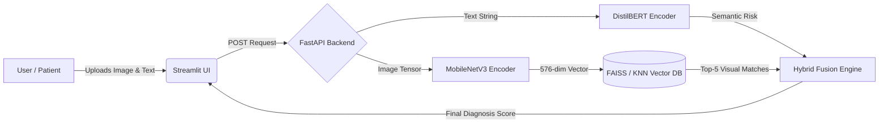

#  DermAIVision - Dermatologist in Your Pocket (v2.1.0 - Full-Stack Web System)
[](https://github.com/fferhatakr/dermai-vision/actions/workflows/python-app.yml)


[](https://opensource.org/licenses/MIT)


##  Disclaimer:
**This project is an AI research and engineering demonstration.**
**It is NOT intended for real medical diagnosis.**


This project is an end-to-end deep learning-based skin cancer classification and retrieval assistant. It covers a complete engineering journey: starting from flat-layer models, extending to custom CNNs, integrating **Multimodal Fusion (MobileNetV3 & DistilBERT)**, and finally evolving into a **Content-Based Image Retrieval (CBIR)** system served via a modern REST API and Web Interface.

##  What's New in v2.1.0: End-to-End Web System
The project is no longer just a set of training scripts. It is now a fully functional product:
* **The Brain (KNN Retrieval):** Instead of standard classification, the model extracts 576-dimensional feature vectors (embeddings) from a new patient's image and compares them against a vast, pre-calculated database of diagnosed cases using K-Nearest Neighbors.
* **The Backend (FastAPI):** A lightning-fast REST API (`uvicorn`) that handles image processing, tensor normalization, and real-time similarity matching.
* **The Frontend (Streamlit):** An interactive, user-friendly web interface where users can upload dermoscopy images and receive instant, confidence-based diagnostic feedback.

##  System Architecture Flow


---

###  Retrieval Instead of Classification
```md
Unlike traditional classifiers, the system does not output a fixed label directly.
Instead, images are mapped into a learned embedding space where visually similar lesions
are located closer together. Diagnosis is inferred by comparing the query embedding
against previously diagnosed reference cases.
```

##  Engineering & Research Journey

Following MLOps best practices, this project separates the **Software/System Versioning** (the pipeline and application logic) from the **Model Registry** (the architectural AI experiments).

###  System Architecture & Pipeline Releases (Software)
This section tracks the engineering evolution of the project's infrastructure.

* **`v1.0.0` - Initial Prototype:** Manual training scripts, data augmentation, and basic PyTorch dataloaders established.
* **`v1.1.0` - Lightning Refactor:** Training pipeline migrated to PyTorch Lightning. Added `ReduceLROnPlateau` for dynamic learning rate adjustments and modularized the codebase.
* **`v2.0.0` - The CBIR Pivot:** Major architectural shift. Transitioned from standard classification to a Content-Based Image Retrieval (CBIR) pipeline using K-Nearest Neighbors (KNN) and Triplet Loss. 
* **`v2.1.0` - Full-Stack Integration:** *(Current)* End-to-end system deployed. Built a FastAPI backend for real-time inference and L2 tensor normalization, coupled with an interactive Streamlit web interface.

###  Model Registry & Experiments (AI Research)
This section tracks the evolution of the AI models.

| Model ID | Architecture | Technique | Engineering Note |
| :--- | :--- | :--- | :--- |
| **`Vision-Exp01`** | Linear (MLP) | Baseline | Proof of concept. Basic skeleton established. |
| **`Vision-Exp02`** | Custom CNN | Class Weights | Overfitting broken; diagnostic blindness for rare classes eliminated. |
| **`Vision-Exp03`** | ResNet18 | Transfer Learning | Pre-trained ImageNet weights integrated; large jump in feature extraction. |
| **`Vision-Mobile-v1`**| MobileNetV3-Small| Mobile Optimization | Lightweight architecture selected for future iOS/Android on-device inference. |
| **`Vision-Embed-v2`** | MobileNetV3 + Triplet| Metric Learning | **Current Production Model.** Optimized to map visually similar conditions closer together in a 576-dimensional embedding space. |

###  NLP Model Registry (Multimodal Expansion)
| Model ID | Architecture | Capability | Note |
| :--- | :--- | :--- | :--- |
| **`NLP-Distil-v1`** | DistilBERT (EN) | Symptom Analysis | Semantic risk factor detection from patient-reported free-text. |

##  Architecture Decisions & Evaluation

To transition this project from a research experiment to an industry-grade product, specific architectural and evaluation decisions were made:

### 1. Model Selection Rationale
* **Vision Backbone (MobileNetV3):** Chosen specifically for its parameter efficiency and compatibility with edge devices. It paves the way for future native iOS/CoreML deployment (v3.0.0) without draining device battery or requiring heavy cloud compute.
* **Text Backbone (DistilBERT):** A lightweight transformer that provides robust semantic understanding of patient-reported symptoms (e.g., *"bleeding"*, *"rapid growth"*) with minimal latency.
* **The CBIR Pivot (Triplet Loss):** Standard softmax classification creates rigid, opaque boundaries. By switching to Triplet Margin Loss, the model learns a 576-dimensional metric space where visually similar lesions are clustered together. This allows for **transparent, evidence-based diagnosis** by physically showing the user the Top-5 most similar historical cases.

### 2. Multimodal Fusion Strategy (Late Fusion)
The system employs a **Late Fusion** mechanism to calculate the `HYBRID SCORE`. 
1. The Vision pipeline outputs a visual risk probability based on KNN distance voting.
2. The NLP pipeline processes free-text symptoms to output a semantic risk probability.
3. A weighted ensemble computes the final diagnostic confidence, mimicking a real dermatologist who evaluates both the visual lesion and the patient's anamnesis.

### 3. Retrieval Evaluation Metrics
Since the system is a Content-Based Image Retrieval (CBIR) engine, standard classification accuracy is insufficient. The model's retrieval quality is evaluated using:
* **Top-1 Accuracy:** Does the single closest retrieved embedding share the exact same diagnosis?
* **Recall@5 (Top-5 Accuracy):** Is the correct diagnosis present within the 5 nearest neighbors?
* **Mean Average Precision (mAP):** Measures the overall clustering quality and ranking order of the retrieved cases in the vector space.


###  Quantitative Benchmark Results (CBIR Pipeline)
To ensure reliability, the models are evaluated not just on accuracy, but on their retrieval capabilities in the embedding space.

| Model ID | Architecture | Recall@5 | mAP | Avg. Inference Latency (CPU) |
| :--- | :--- | :--- | :--- | :--- |
| **`Vision-Exp03`** | ResNet18 (Baseline TL) | 0.78 | 0.71 | ~120ms |
| **`Vision-Mobile-v1`** | MobileNetV3-Small | 0.81 | 0.75 | ~42ms |
| **`Vision-Embed-v2`** | MobileNetV3 + Triplet | **0.87** | **0.82** | **~45ms** |

*Note: The shift to MobileNetV3 drastically reduced latency, making real-time web inference and future mobile deployment viable, while Triplet Loss significantly boosted the Mean Average Precision (mAP) of the retrieval system.*

###  Reproducibility & Training Details
Industry-standard reproducibility is maintained by tracking all hyperparameters and system configurations.

* **Dataset:** ISIC Archive Subset (~8,000+ dermoscopy images)
* **Data Split:** 70% Train / 15% Validation / 15% Test
* **Batch Size:** 32 (optimized for memory constraints)
* **Epochs:** 25 (with Early Stopping patience = 5)
* **Optimizer:** AdamW (Initial LR: 0.001, updated via `ReduceLROnPlateau`)
* **Hardware:** Trained on NVIDIA T4 / Local RTX GPUs
* **Random Seed:** `42` (forced for deterministic weight initialization and splitting)


##  File Structure

```text
AI_DET_PROJECT/
├── checkpoints/              # Trained model weights (not tracked by Git)
│   └── nlp_v1/               # NLP model checkpoints
│
├── configs/                  # Configuration files
│   ├── inference_config.yaml
│   └── train_config.yaml
│
├── Data/                     # Dataset files (not tracked by Git)
│   ├── artifacts/            # Generated reference embeddings (not tracked by Git)
│   ├── images/               # Raw images
│   └── metadata/             # Dataset metadata
│
├── src/                      # Source code
│   ├── api/                  # API entry point
│   │   └── main.py
│   ├── architectures/        # Model architecture definitions
│   │   ├── vision_model.py
│   │   └── text_encoder.py
│   ├── dataloader/           # Dataset and data loading logic
│   │   ├── image_dataset.py
│   │   └── text_corpus.py
│   ├── inference/            # Inference pipeline
│   │   ├── benchmark_retrieval.py
│   │   ├── hybrid_predict.py
│   │   └── infer.py
│   ├── training/             # Training pipeline
│   │   ├── baseline_trainer.py
│   │   ├── contrastive_trainer.py
│   │   ├── nlp_trainer.py
│   │   ├── lightning_trainer.py
│   │   └── trainer_core.py
│   ├── ui/                   # User interface
│   │    └── app.py
│   │ 
│   ├── utils/
│   │   ├── create_embeddings.py
│   │   └── helpers.py
│   │ 
├── test/                     # Unit and integration tests
│   ├── test_dataset.py
│   ├── test_inference.py
│   ├── test_model.py
│   └── test_nlp_model.py
│
├── .env                      # Environment variables (not tracked)
├── .gitignore
├── pytest.ini
├── requirements.txt
└── README.md
```

##  Technologies and Techniques Used

- **Architectures: Custom CNNs, ResNet18, MobileNetV3**
- **Transfer Learning: Fine-tuning pre-trained ImageNet weights (requires_grad=True, low learning rate)**  
- **Data Pipeline: RandomHorizontalFlip, RandomRotation, ColorJitter, ImageNet Normalization.** 
- **Imbalanced Data Solution: Class Weights (sklearn) for vision; data augmentation for NLP.** 
- **Optimization: AdamW optimizer, Dynamic Learning Rate, Softmax Probability Scoring.**  

##  Project Documentation
* **[CHANGELOG.md](CHANGELOG.md):** Detailed history of version updates and fixes.
* **[ROADMAP.md](ROADMAP.md):** Future features and my technical learning path (Docker, iOS, XAI).


##  Installation 

1. Clone the repo:

```bash
git clone https://github.com/fferhatakr/dermai-vision.git
cd dermai-vision
```

2. Create a virtual environment:

```bash
python -m venv venv
source venv/bin/activate  # Linux/Mac
venv\Scripts\activate     # Windows
```

3. Install the required packages:

```bash
pip install -r requirements.txt
```

#  Running the Project

The project now operates as a full-stack application. You need to run both the backend (API) and the frontend (UI) simultaneously.

**1. Start the Backend API (FastAPI & KNN Engine):**
```bash
uvicorn src.api.main:app --reload
```

**2. Start the Web Interface (Streamlit):**
Open a new terminal window (keep the API running) and execute:
```bash
streamlit run src/ui/app.py
```

## 🔹 Embedding Database Initialization (Required)

This system uses a reference embedding database for similarity search.
After training a vision model, embeddings must be generated once before running inference.

```bash
python src/utils/create_embeddings.py
```

###  Developer Guide (Training from Scratch)

**1. Train Vision Model (PyTorch Lightning & Triplet Loss)**
```bash
python src/training/lightning_trainer.py
```
**2. Extract and Save Embeddings (Update the KNN Database)**
```bash
python src/inference/benchmark_retrieval.py
```
**3. Train NLP Model (Symptom Analysis)**
```bash
python src/training/nlp_trainer.py
```


#  Multimodal Fusion (Hybrid Diagnosis)
```bash
python src/inference/hybrid_predict.py
# Output Example:
#  Image Risk : %95.38
#  Complaint Risk : %99.92
#  HYBRID SCORE : %98.10
#  DIAGNOSIS :  RISKY 
```

###  NLP Inference (Symptom Analysis)
You can test the NLP model directly from your Python code:

```python
from src.inference.predict import predict_symptom
# Analyze patient complaint:
result = predict_symptom("My lesion's color has darkened and it bleeds.")
print(f"Output: {result} Risky")
```
