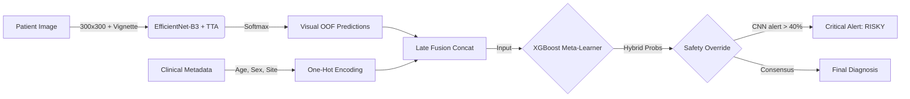

# DermaScan AI - Multimodal Clinical Decision Support System (v6.0.0)


[](https://opensource.org/licenses/MIT)


##  Disclaimer:
**This project is an AI research and engineering demonstration.**
**It is NOT intended for real medical diagnosis.**

**Ethical Disclaimer & Data Privacy Policy**
This application is an engineering portfolio project and AI research demonstration. It is **NOT** intended for real medical diagnosis, treatment, or professional advice. Always consult a qualified dermatologist for medical concerns.
**Data Storage:** Analysis results, patient records, and doctor accounts are stored 
securely in a PostgreSQL database. Images are processed strictly in-memory and are 
never stored on any server.

---

## How It Works: The Architecture

DermaScan AI is not a "black box." It is built on a transparent, scalable, and modern Machine Learning Operations (MLOps) pipeline:

* **The Brain (Deep Learning):** The core vision engine is powered by **EfficientNet-B3**, a state-of-the-art Convolutional Neural Network (CNN) known for its optimal balance of accuracy and computational efficiency. 
* **The Engine (Backend API):** A high-speed **FastAPI** server handles the model inference. It receives image data, preprocesses it for the neural network, and returns structured probability scores.
* **The Cloud (Deployment):** The entire backend, including the heavy 2.3GB model payload, is fully containerized using **Docker** and deployed autonomously on **Hugging Face Spaces**.
* **The Face (Frontend):** A responsive **Streamlit** web application serves as the user interface, establishing a seamless bridge with the remote cloud API.


This project is an end-to-end deep learning-based skin cancer classification system. It covers a complete engineering journey: starting from flat-layer models, extending to custom CNNs, and finally evolving into a **Multimodal Meta-Learning System** that fuses visual feature extraction (EfficientNet-B3) with clinical tabular metadata (Age, Sex, Anatomical Site) using **XGBoost**.


##  System Architecture Flow

**Deployment Note:** The inference engine is served via a Dockerized FastAPI container, decoupled from the Streamlit UI for scalable multimodal processing.

```mermaid
graph LR
    A[Patient Image] -->|300x300 + Vignette| B(EfficientNet-B3 + TTA)
    B -->|Softmax| C[Visual OOF Predictions]
    D[Clinical Metadata] -->|Age, Sex, Site| E[One-Hot Encoding]
    C --> F[Late Fusion Concat]
    E --> F
    F -->|Input| G{XGBoost Meta-Learner}
    G -->|Hybrid Probs| H{Safety Override}
    H -->|CNN alert > 40%| I[Critical Alert: RISKY]
    H -->|Consensus| J[Final Diagnosis]
```
---
## Clinical Dashboard (Streamlit UI)

The system features a dual-engine medical interface built with Streamlit, allowing clinicians to input patient metadata and upload dermoscopic images for real-time analysis.


<div align="center">
  <h3>1. Patient Data & Lesion Input</h3>
  <a href="assets/ui_input.jpg" target="_blank">
    
  </a>
  
  <br><br>

  <h3>2. Hybrid Analysis & Safety Conflict Panel</h3>
  <a href="assets/ui_analysis.jpg" target="_blank">
    
  </a>
  
  <br><br>

  <h3>3. Explainable AI (Grad-CAM Heatmap)</h3>
  <a href="assets/ui_heatmap.jpg" target="_blank">
    
  </a>
</div>


## Key UI Features:
- **Visual XAI (Grad-CAM):** Side-by-side comparison of the original lesion and the AI's focal heatmaps.
- **Debug & Conflict Panel:** Real-time transparency showing the exact probability distributions of both the Vision Pipeline (CNN) and the Meta-Learner (XGBoost).
- **Safety Alerts:** Dynamic UI elements that turn red and trigger a **"Conflict"** warning if the visual suspicion overrides the clinical metadata bias.

## Beyond Pure Vision: The Multimodal Pivot

- **While earlier versions (v4.0.0) successfully transitioned from image retrieval (CBIR) to direct classification, v5.0.0 addresses a fundamental flaw in pure computer vision: clinical context blindness. A lesion on a 20-year-old might be statistically benign, while the exact same visual pattern on an 80-year-old could be highly suspicious. By pivoting to a **Multimodal Diagnostic System**, we no longer rely on naive pixel-based guesses. The system now evaluates structural visual features strictly alongside patient metadata, producing a holistic, real-world clinical decision.**


###  Model Registry & Experiments (AI Research)
This section tracks the evolution of the AI models.

| Model ID | Architecture | Technique | Engineering Note |
| :--- | :--- | :--- | :--- |
| **`Vision-Exp01`** | Linear (MLP) | Baseline | Proof of concept. Basic skeleton established. |
| **`Vision-Exp02`** | Custom CNN | Class Weights | Overfitting broken; diagnostic blindness for rare classes eliminated. |
| **`Vision-Exp03`** | ResNet18 | Transfer Learning | Pre-trained ImageNet weights integrated; large jump in feature extraction. |
| **`Vision-Mobile-v1`**| MobileNetV3-Small| Mobile Optimization | Lightweight architecture selected for future iOS/Android on-device inference. |
| **`Vision-Embed-v2`** | MobileNetV3 + Triplet| Metric Learning |  Optimized to map visually similar conditions closer together in a 576-dimensional embedding space. |
| **`Vision-Embed-v3`** | MobileNetV3 |Triplet + ONNX  |  Latest State-of-the-art. Features 960-dim embeddings. Optimized via ONNX Runtime for 40% faster inference on M1/CPU. |
| **`Vision-Classifier-v3`** | MobileNetV3 + TTA | Weighted Loss + Scheduler | Current Production. Prioritizes Recall & Specificity. Validated on OOD web data |
| **`Vision-Pro-v4`** | EfficientNet-B3 + Hybrid| Focal Loss + Multimodal Fusion | Current Champion. 300x300 high-resolution analysis. Achieved ~80% recall on melanoma.|
| **`Vision-Meta-v5`** | **EfficientNet-B3 + XGBoost** | **Late Fusion + 5-Fold CV + Safety Logic** | Current Champion. Fuses visual probabilities with patient metadata. Prevents stacking leakage via OOF training. Achieves ~82% Melanoma Recall. |


##  Architecture Decisions & Evaluation (Updated v5.0.0)

The critical architectural choices made to transform the project from the research phase into an industrial product are detailed below:

### 1. Model Selection Rationale
* **Vision Backbone (EfficientNet-B3):** MobileNet has been abandoned in favour of the EfficientNet-B3 architecture. This model captures micro-details in skin texture much better by compound scaling the depth, width and resolution parameters in a balanced manner.
* **Classification Paradigm Shift:** The CBIR (search) logic used in previous versions has been abandoned in favour of a direct Multi-class Classification structure. This allows probability values to be obtained directly for 8 different disease classes.

### 2. Multimodal Fusion Strategy (Probabilistic Late Fusion)
Instead of an early feature concatenation (which often causes high-dimensional image vectors to overshadow low-dimensional tabular data), this system uses a **Probabilistic Late Fusion** mechanism:
1. **Vision Pipeline:** EfficientNet-B3 acts as the "Eye", generating probability distributions for 8 skin conditions.
2. **Tabular Pipeline:** Patient metadata (Age, Gender, Site) is One-Hot Encoded.
3. **The Brain (XGBoost):** An XGBoost Meta-Learner takes the visual probabilities and clinical data as input to make the final statistical decision, significantly reducing False Positives caused by visual similarities in different age groups.

### Key Evaluation Metrics
- **Accuracy (~81%):** The model's overall correct prediction rate, validated scientifically across 5 folds.
- **Melanoma Recall (~82%):** The ultimate metric for patient safety. Through Focal Loss and Metadata Fusion, the system catches 8+ out of 10 malignant cases.
- **Conflict Detection:** The UI actively reports disagreements between the "Eye" (CNN) and the "Brain" (XGBoost), providing doctors with transparent "Debug" insights.


###  Reproducibility & Training Details
Industry-standard reproducibility is maintained by tracking all hyperparameters and system configurations.

* **Dataset:** Extended and Balanced ISIC Archive (Class-imbalance mitigated).
* **Data Resolution:** 300x300 High-Resolution Input.
* **Validation Strategy:** Rigorous **5-Fold Cross-Validation** to ensure scientific robustness.
* **Meta-Learner Training:** XGBoost was trained strictly on **Out-Of-Fold (OOF)** predictions to prevent stacking data leakage.
* **Optimizer & Loss:** AdamW Optimizer combined with Focal Loss.
* **Augmentation:** RandomRotation, ColourJitter, Gaussian Vignette, and Test-Time Augmentation (TTA).

##  File Structure

```text
AI_DET_PROJECT/
├── .github/
│   └── workflows/
│       └── python-app.yml
│
├── configs/                  
│   └── .gitkeep
├── Data/                     # Dataset 
│   ├── processed/            
│   └── raw/             
├── scripts/ 
│   └── export_to_onnx.py 
├── src/                      # Source code
│   ├── api/    
│   │   ├── routes/
│   │   │   ├── analyze.py
│   │   │   ├── patients.py
│   │   │   └── users.py
│   │   ├── auth.py
│   │   ├── database.py
│   │   ├── db_models.py
│   │   ├── gradcam.py
│   │   ├── inference.py
│   │   ├── main.py
│   │   ├── models.py              
│   │   └── schemas.py
│   ├── architectures/       
│   │   └── vision_model.py
│   ├── dataloader/           
│   │   └── image_dataset.py
│   ├── engine/
│   │   ├── evaluate_kfold.py
│   │   ├── extract_oof_features.py
│   │   └── train_kfold_v2.py
│   ├── inference/            # Inference pipeline
│   │   └── hybrid_predict.py
│   ├── training/             # Training pipeline
│   │   ├── train_meta.py
│   │   └── trainer_core.py
│   ├── ui/                   # User interface
│   │    └── app.py
│   └──  utils/
│       ├── create_meta_dataset.py
│       └── helpers.py
├── test/
│   └──.gitkeep
├── test_samples/
├── .dockerignore
├── Dockerfile
├── test/                     
├── .env                      
├── .gitignore
├── .gitattributes
├── CHANGELOG.md 
├── LICENSE
├── pytest.ini
├── README.md
├── requirements.txt
└── ROADMAP.md
```

##  Technologies and Techniques Used

- **Data Scaling: Dataset expansion & change.** The model's generalisation ability was improved by expanding the dataset with higher quality and more balanced samples.  
- **Explainable AI (XAI): Grad-CAM** (Penultimate Layer -2). Focus maps visualising the decision-making mechanism.
- **Inference Strategy:** Test-Time Augmentation (TTA) & Sensitivity-Driven Thresholding (MEL/BCC specific threshold values).
- **Infrastructure:** Docker, Docker Hub (Containerization for zero-dependency deployment).
- **CI/CD Readiness:** Standardized environment locking via requirements.txt and Docker layer caching.
- **Authentication:** JWT tokens via `python-jose`, password hashing via `passlib` (bcrypt).
- **Database:** PostgreSQL with SQLAlchemy ORM — users, patients, analyses tables.


##  Project Documentation
* **[CHANGELOG.md](CHANGELOG.md):** Detailed history of version updates and fixes.
* **[ROADMAP.md](ROADMAP.md):** Future features and my technical learning path (Docker, iOS, XAI).


## Installation & Setup

**One-Click Deployment (Recommended)**

The easiest way to run DermaScan AI is using Docker. This avoids manual dependency installation:

```bash
# Pull the pre-built image from Docker Hub
docker pull technull1/dermascan-api:latest

# Run the containerized API
docker run -p 8000:8000 technull1/dermascan-api
```

**1. Clone the Repository:**

```bash
git clone [https://github.com/fferhatakr/dermai-vision.git](https://github.com/fferhatakr/dermai-vision.git)
cd dermai-vision
```

2. Create a virtual environment:

```bash
python -m venv venv
# Activate the environment:
source venv/bin/activate  # Linux/Mac
venv\Scripts\activate     # Windows
```

3. Install the required packages:

```bash
pip install -r requirements.txt
```

## Running the System (v6.0.0)

This project has a dual-stack architecture. You must run the FastAPI Backend and Streamlit Frontend units on separate terminals.

**Step 1: Start the Backend API (TTA Engine)**
```bash
uvicorn src.api.main:app --reload
```

**Step 2: Start the Clinical Interface (UI)**
Open a new terminal, activate the venv, and launch the dashboard:
```bash
streamlit run src/ui/app.py
```


###  Developer Guide (Training from Evaluation)

**1. Train the Classifier (V2 - Weighted Loss):**
```bash
# Trains EfficientNet-B3 with Class Weights & LR Scheduler
python src/engine/train_kfold_v2.py
```
**2. Evaluate with TTA (Test-Time Augmentation):**
```bash
# Runs the evaluation engine on the test set with 3-view voting
python src/engine/evaluate_kfold.py
```


### Acknowledgements
The images and metadata of the "ISIC 2019: Training" data are licensed under a
Creative Commons Attribution-NonCommercial 4.0 International License
(CC-BY-NC).
You should have received a copy of the license along with this
work. If not, see <http://creativecommons.org/licenses/by-nc/4.0/>.
Additional information and documentation for the "ISIC 2019: Training" data
may be found at https://challenge2019.isic-archive.com/ .
The "ISIC 2019: Training" data includes content from several copyright
holders. To comply with the attribution requirements of the CC-BY-NC license,
the aggregate "ISIC 2019: Training" data must be cited as:
  ISIC 2019 data is provided courtesy of the following sources:
  BCN_20000 Dataset: (c) Department of Dermatology, Hospital Clínic de Barcelona
  HAM10000 Dataset: (c) by ViDIR Group, Department of Dermatology, Medical University of Vienna; https://doi.org/10.1038/sdata.2018.161
  MSK Dataset: (c) Anonymous; https://arxiv.org/abs/1710.05006 ; https://arxiv.org/abs/1902.03368