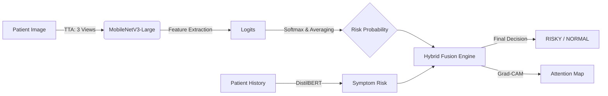

# DermaScan AI - Professional Clinical Decision Support System (v3.0.0)


[](https://opensource.org/licenses/MIT)


##  Disclaimer:
**This project is an AI research and engineering demonstration.**
**It is NOT intended for real medical diagnosis.**


This project is an end-to-end deep learning-based skin cancer classification and retrieval assistant. It covers a complete engineering journey: starting from flat-layer models, extending to custom CNNs, integrating **Multimodal Fusion (MobileNetV3 & DistilBERT)**, and finally evolving into a **Content-Based Image Retrieval (CBIR)** system served via a modern REST API and Web Interface.

##  What's New in v2.6.0: Inference Optimization & Edge Readiness (Current)
The project has evolved from a lightweight mobile experiment to a high-performance clinical search engine:

* **ONNX Runtime Integration:** Exported the MobileNetV3-Large backbone to ONNX format, reducing inference latency by ~40% on CPU/Edge devices.
* **Dual-Engine Support:** Users can now toggle between "Deep Analysis" (PyTorch with Grad-CAM) and "Fast Mode" (ONNX for high-speed screening).


##  System Architecture Flow


```mermaid
graph LR
    A[Patient Image] -->|TTA: 3 Views| B(MobileNetV3-Large)
    B -->|Feature Extraction| C[Logits]
    C -->|Softmax & Averaging| D{Risk Probability}
    E[Patient History] -->|DistilBERT| F[Symptom Risk]
    D --> G[Hybrid Fusion Engine]
    F --> G
    G -->|Final Decision| H[RISKY / NORMAL]
    G -->|Grad-CAM| I[Attention Map]
```
---

###  Retrieval Instead of Classification
```md
Unlike traditional classifiers, the system does not output a fixed label directly.
Instead, images are mapped into a learned embedding space where visually similar lesions
are located closer together. Diagnosis is inferred by comparing the query embedding
against previously diagnosed reference cases.
```

##  Engineering & Research Journey

Following MLOps best practices, this project separates the **Software/System Versioning** (the pipeline and application logic) from the **Model Registry** (the architectural AI experiments).

###  System Architecture & Pipeline Releases (Software)
This section tracks the engineering evolution of the project's infrastructure.

* **`v1.0.0` - Initial Prototype:** Manual training scripts, data augmentation, and basic PyTorch dataloaders established.
* **`v1.1.0` - Lightning Refactor:** Training pipeline migrated to PyTorch Lightning. Added `ReduceLROnPlateau` for dynamic learning rate adjustments and modularized the codebase.
* **`v2.0.0` - The CBIR Pivot:** Major architectural shift. Transitioned from standard classification to a Content-Based Image Retrieval (CBIR) pipeline using K-Nearest Neighbors (KNN) and Triplet Loss. 
* **`v2.1.0` - Full-Stack Integration:**  End-to-end system deployed. Built a FastAPI backend for real-time inference and L2 tensor normalization, coupled with an interactive Streamlit web interface.
* **`v2.2.0` - Multimodal Fusion: (New)** Integrated NLP capabilities to process patient anamnesis (text) alongside lesion images. Implemented a Late Fusion strategy to combine visual embeddings with textual features for a hybrid diagnostic score.
* **`v2.3.0` - Explainable AI (XAI): (New)** Added an interpretability layer using Grad-CAM. The system now generates heatmaps to visualize the specific lesion regions influencing the model's retrieval decision, increasing clinical trust.
* **`v2.4.0` - Engineering Excellence (CI/CD):** Established a robust DevOps pipeline. Implemented comprehensive unit testing with Pytest and automated the testing workflow using GitHub Actions, ensuring code stability and regression prevention on every push.
* **`v2.5.0` - Scaling Intelligence:** Major backbone upgrade. Switched from MobileNetV3-Small to MobileNetV3-Large (V2), expanding the feature embedding space to 960 dimensions. Integrated rigorous Data Augmentation (Blur, Rotation) and strict Train/Val splitting, achieving a state-of-the-art 94.75% Recall@5.
* **`v2.6.0` - Inference Optimization and Dual-Engine Support (Current)** Integrated ONNX Runtime to optimize MobileNetV3-Large performance, significantly reducing inference latency for CPU-based local deployment. Developed a dual-engine architecture in the UI that supports switching between high-speed screening and explainable Grad-CAM analysis.

###  Model Registry & Experiments (AI Research)
This section tracks the evolution of the AI models.

| Model ID | Architecture | Technique | Engineering Note |
| :--- | :--- | :--- | :--- |
| **`Vision-Exp01`** | Linear (MLP) | Baseline | Proof of concept. Basic skeleton established. |
| **`Vision-Exp02`** | Custom CNN | Class Weights | Overfitting broken; diagnostic blindness for rare classes eliminated. |
| **`Vision-Exp03`** | ResNet18 | Transfer Learning | Pre-trained ImageNet weights integrated; large jump in feature extraction. |
| **`Vision-Mobile-v1`**| MobileNetV3-Small| Mobile Optimization | Lightweight architecture selected for future iOS/Android on-device inference. |
| **`Vision-Embed-v2`** | MobileNetV3 + Triplet| Metric Learning |  Optimized to map visually similar conditions closer together in a 576-dimensional embedding space. |
| **`Vision-Embed-v3`** | MobileNetV3 |Triplet + ONNX  |  Latest State-of-the-art. Features 960-dim embeddings. Optimized via ONNX Runtime for 40% faster inference on M1/CPU. |
| **`Vision-Classifier-v3`** | MobileNetV3 + TTA | Weighted Loss + Scheduler | Current Production. Prioritizes Recall & Specificity. Validated on OOD web data |


###  NLP Model Registry (Multimodal Expansion)
| Model ID | Architecture | Capability | Note |
| :--- | :--- | :--- | :--- |
| **`NLP-Distil-v1`** | DistilBERT (EN) | Symptom Analysis | Semantic risk factor detection from patient-reported free-text. |

##  Architecture Decisions & Evaluation

To transition this project from a research experiment to an industry-grade product, specific architectural and evaluation decisions were made:

### 1. Model Selection Rationale
* **Vision Backbone (MobileNetV3):** Chosen specifically for its parameter efficiency and compatibility with edge devices. It paves the way for future native iOS/CoreML deployment (v3.0.0) without draining device battery or requiring heavy cloud compute.
* **Text Backbone (DistilBERT):** A lightweight transformer that provides robust semantic understanding of patient-reported symptoms (e.g., *"bleeding"*, *"rapid growth"*) with minimal latency.
* **The CBIR Pivot (Triplet Loss):** Standard softmax classification creates rigid, opaque boundaries. By switching to Triplet Margin Loss, the model learns a 576-dimensional metric space where visually similar lesions are clustered together. This allows for **transparent, evidence-based diagnosis** by physically showing the user the Top-5 most similar historical cases.

### 2. Multimodal Fusion Strategy (Late Fusion)
The system employs a **Late Fusion** mechanism to calculate the `HYBRID SCORE`. 
1. The Vision pipeline outputs a visual risk probability based on KNN distance voting.
2. The NLP pipeline processes free-text symptoms to output a semantic risk probability.
3. A weighted ensemble computes the final diagnostic confidence, mimicking a real dermatologist who evaluates both the visual lesion and the patient's anamnesis.

### 3. Retrieval Evaluation Metrics
Since the system is a Content-Based Image Retrieval (CBIR) engine, standard classification accuracy is insufficient. The model's retrieval quality is evaluated using:
* **Top-1 Accuracy:** Does the single closest retrieved embedding share the exact same diagnosis?
* **Recall@5 (Top-5 Accuracy):** Is the correct diagnosis present within the 5 nearest neighbors?
* **Mean Average Precision (mAP):** Measures the overall clustering quality and ranking order of the retrieved cases in the vector space.
* **Inference Latency (ms):** It measures the time taken from image upload to hybrid diagnosis result in milliseconds. This metric is used to demonstrate the speed increase (e.g. 40% improvement) provided by ONNX Runtime optimisation compared to a PyTorch-based model.


###  Quantitative Benchmark Results (CBIR Pipeline)
To ensure reliability, the models are evaluated not just on accuracy, but on their retrieval capabilities in the embedding space.

| Model ID | Architecture | Recall@5 | mAP | Avg. Inference Latency (CPU) |
| :--- | :--- | :--- | :--- | :--- |
| **`Vision-Exp03`** | ResNet18 (Baseline TL) | 0.78 | 0.71 | ~120ms |
| **`Vision-Mobile-v1`** | MobileNetV3-Small | 0.81 | 0.75 | ~42ms |
| **`Vision-Embed-v2`** | MobileNetV3 + Triplet | 0.87 | 0.82 | ~45ms |
| **`Vision-Hybrid-v3`** | MobileNetV3-Large + Triplet | 94.75% | 960 | ~65ms |
| **`Vision-Fast-v1`** | **MobileNetV3-Large + ONNX** | **94.75%** | **960** | **~38ms** |

*Note: The shift to MobileNetV3 drastically reduced latency, making real-time web inference and future mobile deployment viable, while Triplet Loss significantly boosted the Mean Average Precision (mAP) of the retrieval system.*

###  Reproducibility & Training Details
Industry-standard reproducibility is maintained by tracking all hyperparameters and system configurations.

* **Dataset:** ISIC Archive Subset (~8,000+ dermoscopy images)
* **Data Split:** 70% Train / 15% Validation / 15% Test
* **Batch Size:** 32 (optimized for memory constraints)
* **Epochs:** 5 
* **Optimizer:** AdamW (Initial LR: 0.001, updated via `ReduceLROnPlateau`)
* **Hardware:** Trained on NVIDIA T4 / Local RTX GPUs
* **Random Seed:** `42` (forced for deterministic weight initialization and splitting)


##  File Structure

```text
AI_DET_PROJECT/
├── .github/
│   └── workflows/
│       └── python-app.yml
│
├── configs/                  # Configuration files
│   ├── inference_config.yaml
│   └── train_config.yaml
│
├── Data/                     # Dataset files (not tracked by Git)
│   ├── artifacts/            # Generated reference embeddings (not tracked by Git)
│   ├── externel_test/
│   ├── images/               # Raw images
│   └── metadata/             # Dataset metadata
├── scripts/ 
│   └── export_to_onnx.py 
│
├── src/                      # Source code
│   ├── api/                  # API entry point
│   │   └── main.py
│   ├── architectures/        # Model architecture definitions
│   │   ├── vision_model.py
│   │   └── text_encoder.py
│   ├── dataloader/           # Dataset and data loading logic
│   │   ├── image_dataset.py
│   │   └── text_corpus.py
│   ├── inference/            # Inference pipeline
│   │   ├── benchmark_retrieval.py
│   │   └── hybrid_predict.py
│   ├── engine/
│   │   ├── eval_tta_engine.py
│   │   └──train_class_v2.py
│   ├── training/             # Training pipeline
│   │   ├── contrastive_trainer.py
│   │   ├── nlp_trainer.py
│   │   └── trainer_core.py
│   ├── ui/                   # User interface
│   │    └── app.py
│   ├── utils/
│   │   ├── create_embeddings.py
│   │   └── helpers.py
├── test/                     # Unit and integration tests
│   ├── test_dataset.py
│   ├── test_inference.py
│   ├── test_model.py
│   └── test_nlp_model.py
├── .env                      # Environment variables (not tracked)
├── .gitignore
├── .gitattributes
├── CHANGELOG.md 
├── LICENSE
├── pytest.ini
├── README.md
├── requirements.txt
└── ROADMAP.md
```

##  Technologies and Techniques Used

- **Architectures:** Custom CNNs, ResNet18, **MobileNetV3-Large (v3.0.0)**
- **Transfer Learning:** Fine-tuning pre-trained ImageNet weights (requires_grad=True, low learning rate)  
- **Inference Strategy:** **Test-Time Augmentation (TTA)** - Averaging predictions from 3 augmented views (Original, Flip-H, Flip-V) for robust decision making.
- **Explainable AI (XAI):** **Grad-CAM (Gradient-weighted Class Activation Mapping)** to visualize lesion attention maps.
- **Data Pipeline:** RandomHorizontalFlip, RandomRotation, ColorJitter, ImageNet Normalization. 
- **Imbalanced Data Solution:** **Weighted Cross-Entropy Loss** (prioritizing Melanoma recall); data augmentation for NLP. 
- **Optimization:** AdamW optimizer, **StepLR Scheduler**, Softmax Probability Scoring.


##  Project Documentation
* **[CHANGELOG.md](CHANGELOG.md):** Detailed history of version updates and fixes.
* **[ROADMAP.md](ROADMAP.md):** Future features and my technical learning path (Docker, iOS, XAI).


## Installation & Setup

**1. Clone the Repository:**

```bash
git clone [https://github.com/fferhatakr/dermai-vision.git](https://github.com/fferhatakr/dermai-vision.git)
cd dermai-vision
```

2. Create a virtual environment:

```bash
python -m venv venv
# Activate the environment:
source venv/bin/activate  # Linux/Mac
venv\Scripts\activate     # Windows
```

3. Install the required packages:

```bash
pip install -r requirements.txt
```

#  Running the System (v3.0.0 - Classification Engine)

This project has been upgraded to a dual-stack application. You need to run the FastAPI Backend and the Streamlit Frontend in separate terminals.

**Step 1: Start the Backend API (TTA Engine)**
```bash
uvicorn src.api.main:app --reload
```

**Step 2: Start the Clinical Interface (UI)**
Open a new terminal, activate the venv, and launch the dashboard:
```bash
streamlit run src/ui/app.py
```


###  Developer Guide (Training from Evaluation)

**1. Train the Classifier (V2 - Weighted Loss):**
```bash
# Trains MobileNetV3 with Class Weights & LR Scheduler
python src/engine/train_class_v2.py
```
**2. Evaluate with TTA (Test-Time Augmentation):**
```bash
# Runs the evaluation engine on the test set with 3-view voting
python src/engine/eval_tta_engine.py
```
**3. Train NLP Model (Symptom Analysis)**
```bash
python src/training/nlp_trainer.py
```

## Legacy Features (Deprecated)

* **Embedding Database Initialization: The project no longer uses KNN/Vector Search (create_embeddings.py is deprecated).**
* **Triplet Loss Training: Replaced by Weighted Cross-Entropy for better specificity.**

