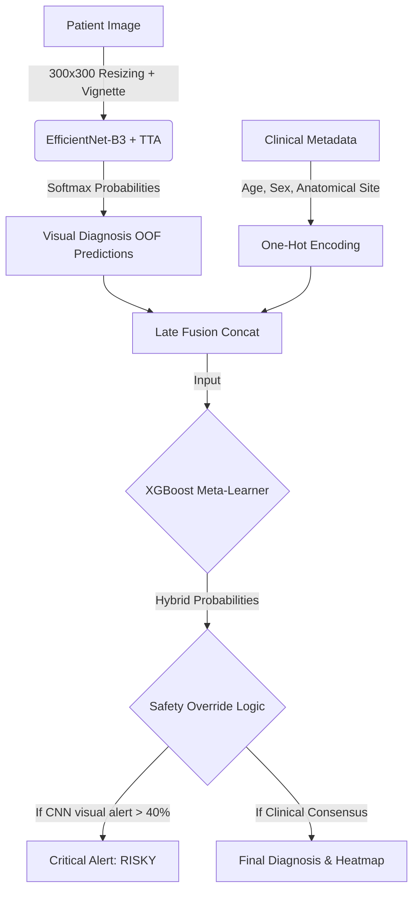

# DermaScan AI - Multimodal Clinical Decision Support System (v5.0.0)


[](https://opensource.org/licenses/MIT)


##  Disclaimer:
**This project is an AI research and engineering demonstration.**
**It is NOT intended for real medical diagnosis.**


This project is an end-to-end deep learning-based skin cancer classification system. It covers a complete engineering journey: starting from flat-layer models, extending to custom CNNs, and finally evolving into a **Multimodal Meta-Learning System** that fuses visual feature extraction (EfficientNet-B3) with clinical tabular metadata (Age, Sex, Anatomical Site) using **XGBoost**.

##  What's New in v5.0.0: The Meta-Learner & Safety Update (Current)
The project has officially transitioned from a pure Computer Vision task to a holistic Clinical Diagnostic Assistant. 

* **Clinical Metadata Fusion (Late Fusion):** The system no longer relies solely on pixels. It fuses the CNN's (EfficientNet-B3) visual probabilities with the patient's Age, Gender, and Anatomical Site. An XGBoost Meta-Learner processes this combined data to produce a highly accurate, clinically contextualized diagnosis.
* **Safety Override Mechanism:** In medical AI, False Negatives are fatal. A hardcoded safety logic was introduced: Even if the Meta-Learner predicts a benign lesion (e.g., due to young patient age), if the Vision model's visual suspicion for malignancy exceeds 40%, the system overrides the decision and triggers a **"RISKY (VISUAL ALERT)"** warning.
* **Scientific Robustness (5-Fold CV & OOF):** To prevent "lucky splits" and data leakage during stacking, the system was validated using a rigorous 5-Fold Cross Validation pipeline. The XGBoost meta-learner was strictly trained on Out-Of-Fold (OOF) predictions.
* **Refined Preprocessing:** Replaced hard edge-cropping with a dynamic Gaussian Vignette filter to maintain peripheral focus without losing corner lesion details.


##  System Architecture Flow


```mermaid
graph TD
    A[Patient Image] -->|300x300 Resizing + Vignette| B(EfficientNet-B3 + TTA)
    B -->|Softmax Probabilities| C[Visual Diagnosis OOF Predictions]
    D[Clinical Metadata] -->|Age, Sex, Anatomical Site| E[One-Hot Encoding]
    C --> F[Late Fusion Concat]
    E --> F
    F -->|Input| G{XGBoost Meta-Learner}
    G -->|Hybrid Probabilities| H{Safety Override Logic}
    H -->|If CNN visual alert > 40%| I[Critical Alert: RISKY]
    H -->|If Clinical Consensus| J[Final Diagnosis & Heatmap]
```
---
## Clinical Dashboard (Streamlit UI)

The system features a dual-engine medical interface built with Streamlit, allowing clinicians to input patient metadata and upload dermoscopic images for real-time analysis.


<div align="center">
  
  
  
  <br><br>
  
  
</div>

### Key UI Features:
- **Visual XAI (Grad-CAM):** Side-by-side comparison of the original lesion and the AI's focal heatmaps.
- **Debug & Conflict Panel:** Real-time transparency showing the exact probability distributions of both the Vision Pipeline (CNN) and the Meta-Learner (XGBoost).
- **Safety Alerts:** Dynamic UI elements that turn red and trigger a **"Conflict"** warning if the visual suspicion overrides the clinical metadata bias.

### Beyond Pure Vision: The Multimodal Pivot

While earlier versions (v4.0.0) successfully transitioned from image retrieval (CBIR) to direct classification, v5.0.0 addresses a fundamental flaw in pure computer vision: clinical context blindness. A lesion on a 20-year-old might be statistically benign, while the exact same visual pattern on an 80-year-old could be highly suspicious. By pivoting to a **Multimodal Diagnostic System**, we no longer rely on naive pixel-based guesses. The system now evaluates structural visual features strictly alongside patient metadata, producing a holistic, real-world clinical decision.

##  Engineering & Research Journey

Following MLOps best practices, this project separates the **Software/System Versioning** (the pipeline and application logic) from the **Model Registry** (the architectural AI experiments).

###  System Architecture & Pipeline Releases (Software)
This section tracks the engineering evolution of the project's infrastructure.

* **`v1.0.0` - Initial Prototype:** Manual training scripts, data augmentation, and basic PyTorch dataloaders established.
* **`v1.1.0` - Lightning Refactor:** Training pipeline migrated to PyTorch Lightning. Added `ReduceLROnPlateau` for dynamic learning rate adjustments and modularized the codebase.
* **`v2.0.0` - The CBIR Pivot:** Major architectural shift. Transitioned from standard classification to a Content-Based Image Retrieval (CBIR) pipeline using K-Nearest Neighbors (KNN) and Triplet Loss. 
* **`v2.1.0` - Full-Stack Integration:**  End-to-end system deployed. Built a FastAPI backend for real-time inference and L2 tensor normalization, coupled with an interactive Streamlit web interface.
* **`v2.2.0` - Multimodal Fusion: (New)** Integrated NLP capabilities to process patient anamnesis (text) alongside lesion images. Implemented a Late Fusion strategy to combine visual embeddings with textual features for a hybrid diagnostic score.
* **`v2.3.0` - Explainable AI (XAI): (New)** Added an interpretability layer using Grad-CAM. The system now generates heatmaps to visualize the specific lesion regions influencing the model's retrieval decision, increasing clinical trust.
* **`v2.4.0` - Engineering Excellence (CI/CD):** Established a robust DevOps pipeline. Implemented comprehensive unit testing with Pytest and automated the testing workflow using GitHub Actions, ensuring code stability and regression prevention on every push.
* **`v2.5.0` - Scaling Intelligence:** Major backbone upgrade. Switched from MobileNetV3-Small to MobileNetV3-Large (V2), expanding the feature embedding space to 960 dimensions. Integrated rigorous Data Augmentation (Blur, Rotation) and strict Train/Val splitting, achieving a state-of-the-art 94.75% Recall@5.
* **`v2.6.0` - Inference Optimization and Dual-Engine Support** Integrated ONNX Runtime to optimize MobileNetV3-Large performance, significantly reducing inference latency for CPU-based local deployment. Developed a dual-engine architecture in the UI that supports switching between high-speed screening and explainable Grad-CAM analysis.
* **`v3.0.0` - The "Honest AI" Update** The "Honest AI" Update: A Dynamic Thresholding system has been integrated to improve recall success. The hybrid risk engine, which combines image and clinical history data, has been synchronized with the Streamlit interface. The FastAPI architecture has been migrated to a modern lifespan structure.
* **`v4.0.0` - The "Clinical Champion" Update:** The system's brain was upgraded to the EfficientNet-B3 architecture. Training resolution was increased to 300x300. Integration of Focal Loss optimised learning success in rare cancer types (e.g., melanoma).
* **`v5.0.0` - The "Meta-Learner & Safety" Update (Current):** The ultimate multimodal leap. Replaced DistilBERT NLP with structured clinical metadata (Age, Sex, Site). Integrated an XGBoost Meta-Learner via Late Fusion. Implemented a 5-Fold Cross Validation pipeline with OOF predictions. Introduced a hardcoded "Safety Override" logic to prioritize visual CNN alerts over statistical biases, maximizing Melanoma recall (~82%) and medical ethics compliance.


###  Model Registry & Experiments (AI Research)
This section tracks the evolution of the AI models.

| Model ID | Architecture | Technique | Engineering Note |
| :--- | :--- | :--- | :--- |
| **`Vision-Exp01`** | Linear (MLP) | Baseline | Proof of concept. Basic skeleton established. |
| **`Vision-Exp02`** | Custom CNN | Class Weights | Overfitting broken; diagnostic blindness for rare classes eliminated. |
| **`Vision-Exp03`** | ResNet18 | Transfer Learning | Pre-trained ImageNet weights integrated; large jump in feature extraction. |
| **`Vision-Mobile-v1`**| MobileNetV3-Small| Mobile Optimization | Lightweight architecture selected for future iOS/Android on-device inference. |
| **`Vision-Embed-v2`** | MobileNetV3 + Triplet| Metric Learning |  Optimized to map visually similar conditions closer together in a 576-dimensional embedding space. |
| **`Vision-Embed-v3`** | MobileNetV3 |Triplet + ONNX  |  Latest State-of-the-art. Features 960-dim embeddings. Optimized via ONNX Runtime for 40% faster inference on M1/CPU. |
| **`Vision-Classifier-v3`** | MobileNetV3 + TTA | Weighted Loss + Scheduler | Current Production. Prioritizes Recall & Specificity. Validated on OOD web data |
| **`Vision-Pro-v4`** | EfficientNet-B3 + Hybrid| Focal Loss + Multimodal Fusion | Current Champion. 300x300 high-resolution analysis. Achieved ~80% recall on melanoma.|
| **`Vision-Meta-v5`** | **EfficientNet-B3 + XGBoost** | **Late Fusion + 5-Fold CV + Safety Logic** | Current Champion. Fuses visual probabilities with patient metadata. Prevents stacking leakage via OOF training. Achieves ~82% Melanoma Recall. |


##  Architecture Decisions & Evaluation (Updated v4.0.0)

The critical architectural choices made to transform the project from the research phase into an industrial product are detailed below:

### 1. Model Selection Rationale
* **Vision Backbone (EfficientNet-B3):** MobileNet has been abandoned in favour of the EfficientNet-B3 architecture. This model captures micro-details in skin texture much better by compound scaling the depth, width and resolution parameters in a balanced manner.
* **Classification Paradigm Shift:** The CBIR (search) logic used in previous versions has been abandoned in favour of a direct Multi-class Classification structure. This allows probability values to be obtained directly for 8 different disease classes.

### 2. Multimodal Fusion Strategy (Probabilistic Late Fusion)
Instead of an early feature concatenation (which often causes high-dimensional image vectors to overshadow low-dimensional tabular data), this system uses a **Probabilistic Late Fusion** mechanism:
1. **Vision Pipeline:** EfficientNet-B3 acts as the "Eye", generating probability distributions for 8 skin conditions.
2. **Tabular Pipeline:** Patient metadata (Age, Gender, Site) is One-Hot Encoded.
3. **The Brain (XGBoost):** An XGBoost Meta-Learner takes the visual probabilities and clinical data as input to make the final statistical decision, significantly reducing False Positives caused by visual similarities in different age groups.

### Key Evaluation Metrics
- **Accuracy (~81%):** The model's overall correct prediction rate, validated scientifically across 5 folds.
- **Melanoma Recall (~82%):** The ultimate metric for patient safety. Through Focal Loss and Metadata Fusion, the system catches 8+ out of 10 malignant cases.
- **Conflict Detection:** The UI actively reports disagreements between the "Eye" (CNN) and the "Brain" (XGBoost), providing doctors with transparent "Debug" insights.


###  Reproducibility & Training Details
Industry-standard reproducibility is maintained by tracking all hyperparameters and system configurations.

* **Dataset:** Extended and Balanced ISIC Archive (Class-imbalance mitigated).
* **Data Resolution:** 300x300 High-Resolution Input.
* **Validation Strategy:** Rigorous **5-Fold Cross-Validation** to ensure scientific robustness.
* **Meta-Learner Training:** XGBoost was trained strictly on **Out-Of-Fold (OOF)** predictions to prevent stacking data leakage.
* **Optimizer & Loss:** AdamW Optimizer combined with Focal Loss.
* **Augmentation:** RandomRotation, ColourJitter, Gaussian Vignette, and Test-Time Augmentation (TTA).

##  File Structure

```text
AI_DET_PROJECT/
├── .github/
│   └── workflows/
│       └── python-app.yml
│
├── configs/                  
│
├── Data/                     # Dataset 
│   ├── processed/            
│   └── raw/             
├── scripts/ 
│   └── export_to_onnx.py 
│
├── src/                      # Source code
│   ├── api/                  
│   │   └── main.py
│   ├── architectures/       
│   │   └── vision_model.py
│   ├── dataloader/           
│   │   └── image_dataset.py
│   ├── inference/            # Inference pipeline
│   │   └── hybrid_predict.py
│   ├── engine/
│   │   ├── eval_engine.py
│   │   ├── evaluate_kfold.py
│   │   ├── extract_oof_features.py
│   │   └── train_kfold_v2.py
│   ├── training/             # Training pipeline
│   │   ├── train_meta.py
│   │   └── trainer_core.py
│   ├── ui/                   # User interface
│   │    └── app.py
│   └──  utils/
│       ├── create_meta_dataset.py
│       └── helpers.py
├── test/                     
├── .env                      
├── .gitignore
├── .gitattributes
├── CHANGELOG.md 
├── LICENSE
├── pytest.ini
├── README.md
├── requirements.txt
└── ROADMAP.md
```

##  Technologies and Techniques Used

- **Architectures:** EfficientNet-B3 (v4.0.0 Upgrade) - Feature extraction has been maximised by transitioning to a wider and deeper architecture than MobileNet.
- **Data Scaling: Dataset expansion & change.** The model's generalisation ability was improved by expanding the dataset with higher quality and more balanced samples.  
- **Input Resolution:** 300x300 High-Resolution Input. (Resolution increased from 224 to 300 to reduce loss of lesion detail).
- **Explainable AI (XAI): Grad-CAM** (Penultimate Layer -2). Focus maps visualising the decision-making mechanism.
- **Optimization Strategy:** Focal Loss & Weighted Random Sampler. Advanced optimisation focusing on rare classes (DF, VASC, etc.) to resolve class imbalance.
- **Multimodal Late Fusion:** Integration of XGBoost to combine CNN softmax outputs with structured clinical metadata (Age, Sex, Site).
- **Out-of-Fold (OOF) Stacking:** Preventing data leakage during the training of the meta-learner by strictly using 5-Fold CV OOF predictions.
- **Safety-First Thresholding (Safety Override):** A custom algorithmic lock that prevents statistical bias (e.g., young age) from masking strong visual indicators of malignancy.
- **Inference Strategy:** Test-Time Augmentation (TTA) & Sensitivity-Driven Thresholding (MEL/BCC specific threshold values).


##  Project Documentation
* **[CHANGELOG.md](CHANGELOG.md):** Detailed history of version updates and fixes.
* **[ROADMAP.md](ROADMAP.md):** Future features and my technical learning path (Docker, iOS, XAI).


## Installation & Setup

**1. Clone the Repository:**

```bash
git clone [https://github.com/fferhatakr/dermai-vision.git](https://github.com/fferhatakr/dermai-vision.git)
cd dermai-vision
```

2. Create a virtual environment:

```bash
python -m venv venv
# Activate the environment:
source venv/bin/activate  # Linux/Mac
venv\Scripts\activate     # Windows
```

3. Install the required packages:

```bash
pip install -r requirements.txt
```

#  Running the System (v5.0.0 - Classification Engine)

This project has a dual-stack architecture. You must run the FastAPI Backend and Streamlit Frontend units on separate terminals.

**Step 1: Start the Backend API (TTA Engine)**
```bash
uvicorn src.api.main:app --reload
```

**Step 2: Start the Clinical Interface (UI)**
Open a new terminal, activate the venv, and launch the dashboard:
```bash
streamlit run src/ui/app.py
```


###  Developer Guide (Training from Evaluation)

**1. Train the Classifier (V2 - Weighted Loss):**
```bash
# Trains EfficientNet-B3 with Class Weights & LR Scheduler
python src/engine/train_kfold_v2.py
```
**2. Evaluate with TTA (Test-Time Augmentation):**
```bash
# Runs the evaluation engine on the test set with 3-view voting
python src/engine/evaluate_kfold.py
```

## Legacy Features (Architectural Evolution)

* **NLP & Text Anamnesis (v2.x - v4.x):** The free-text symptom analysis using DistilBERT has been deprecated. It was replaced by structured tabular metadata (Age, Sex, Site) feeding into an XGBoost Meta-Learner for higher clinical reliability and stability.
* **KNN & Vector Search (v2.x.x):** The project no longer uses similarity searches. It transitioned directly to a probability-based Multi-class Diagnosis structure.
* **Triplet Loss Training:** To reduce complexity and clarify class distinctions, the metric learning protocol was disabled.
* **MobileNetV3 Backbone:** Replaced by **EfficientNet-B3**, which performs much deeper tissue analysis.
* **Standard Weighted Cross-Entropy:** Replaced by the **Focal Loss** architecture to learn the "hard examples" (e.g., Melanoma) efficiently.


### Acknowledgements
The images and metadata of the "ISIC 2019: Training" data are licensed under a
Creative Commons Attribution-NonCommercial 4.0 International License
(CC-BY-NC).
You should have received a copy of the license along with this
work. If not, see <http://creativecommons.org/licenses/by-nc/4.0/>.
Additional information and documentation for the "ISIC 2019: Training" data
may be found at https://challenge2019.isic-archive.com/ .
The "ISIC 2019: Training" data includes content from several copyright
holders. To comply with the attribution requirements of the CC-BY-NC license,
the aggregate "ISIC 2019: Training" data must be cited as:
  ISIC 2019 data is provided courtesy of the following sources:
  BCN_20000 Dataset: (c) Department of Dermatology, Hospital Clínic de Barcelona
  HAM10000 Dataset: (c) by ViDIR Group, Department of Dermatology, Medical University of Vienna; https://doi.org/10.1038/sdata.2018.161
  MSK Dataset: (c) Anonymous; https://arxiv.org/abs/1710.05006 ; https://arxiv.org/abs/1902.03368