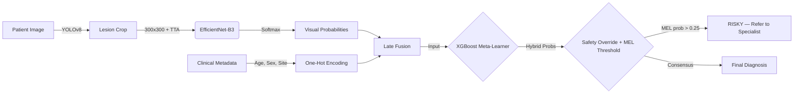
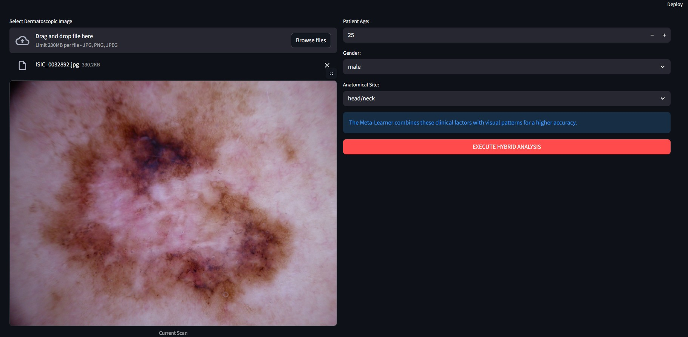
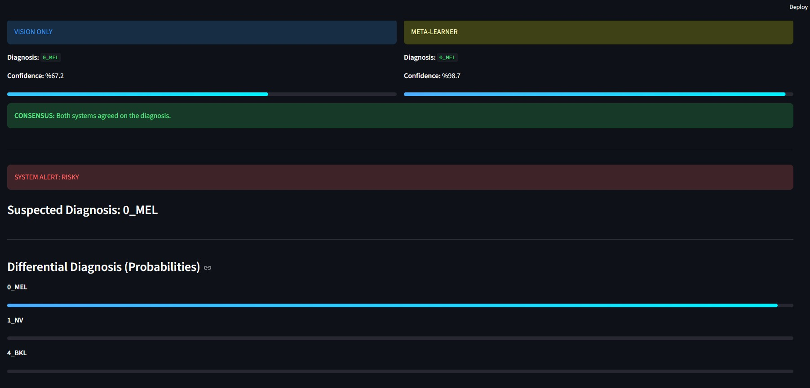
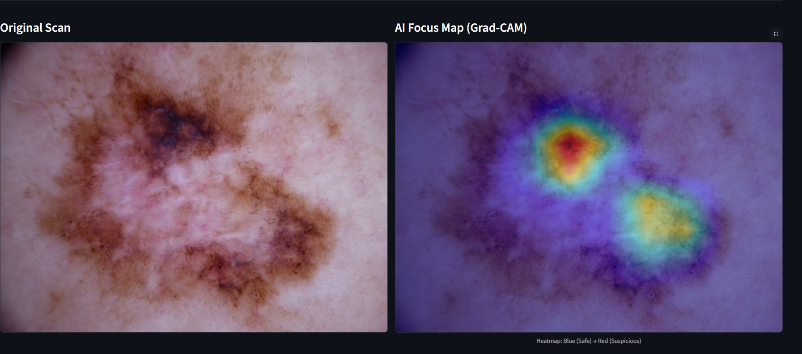

# DermaScan AI — Multimodal Clinical Decision Support System

-blue)
-green)


[](https://opensource.org/licenses/MIT)


## Disclaimer

**This project is an AI research and engineering demonstration. It is NOT intended for real medical diagnosis.**

Analysis results, patient records, and doctor accounts are stored securely in a PostgreSQL database. Images are processed strictly in-memory and are never stored on any server.

---

## How It Works

DermaScan AI is a multi-stage diagnostic pipeline that combines lesion detection, visual classification, clinical metadata fusion, and safety-critical threshold optimization.


```mermaid
graph LR
    A[Patient Image] -->|YOLOv8| B[Lesion Crop]
    B -->|300x300 + TTA| C(EfficientNet-B3)
    C -->|Softmax| D[Visual Probabilities]
    E[Clinical Metadata] -->|Age, Sex, Site| F[One-Hot Encoding]
    D --> G[Late Fusion]
    F --> G
    G -->|Input| H{XGBoost Meta-Learner}
    H -->|Hybrid Probs| I{Safety Override + MEL Threshold}
    I -->|MEL prob > 0.25| J[RISKY — Refer to Specialist]
    I -->|Consensus| K[Final Diagnosis]
```

### Pipeline stages

1. **YOLOv8 Lesion Detection** — Localizes the lesion and crops irrelevant background, reducing noise for the classifier.
2. **EfficientNet-B3 Classification** — Extracts visual features from the cropped lesion at 300x300 resolution. Test-Time Augmentation (5-view: original, horizontal flip, vertical flip, 90° and 270° rotation) improves robustness.
3. **XGBoost Meta-Learner** — Fuses CNN probabilities with patient metadata (age, sex, anatomical site) via late fusion. Trained on Out-Of-Fold predictions to prevent stacking leakage.
4. **Safety Override** — Threshold-optimized melanoma detection (threshold=0.11) ensures MEL recall ≥80%, prioritizing patient safety over overall accuracy.

---

## Clinical Dashboard (Streamlit UI)

<div align="center">
  <h3>Patient data and lesion input</h3>
  <a href="assets/ui_input.jpg"></a>
  <br><br>
  <h3>Hybrid analysis and safety conflict panel</h3>
  <a href="assets/ui_analysis.jpg"></a>
  <br><br>
  <h3>Explainable AI (Grad-CAM heatmap)</h3>
  <a href="assets/ui_heatmap.jpg"></a>
</div>

**Key UI features:**
- Visual XAI via Grad-CAM showing the model's focal regions
- Debug panel showing CNN vs XGBoost probability distributions
- Dynamic safety alerts when visual suspicion overrides clinical metadata

---

## Evaluation Methodology

All metrics are computed using an honest evaluation infrastructure:

- **StratifiedGroupKFold** — Lesion-based splitting prevents data leakage (same lesion never appears in both train and val)
- **Separated train/val metrics** — Independent torchmetrics instances prevent state contamination
- **Correct index mapping** — ImageFolder indices properly mapped to metadata CSV

### Current performance

| Metric | Standard (argmax) | TTA | TTA + Threshold (0.25) |
|--------|-------------------|-----|------------------------|
| Overall accuracy | 70% | 77% | **77%** |
| MEL recall | 55% | 90% | **90%** |
| MEL F1 | 0.68 | 0.79 | **0.79** |
| XGBoost accuracy | — | — | **85%** |

### Cross-Dataset Generalization (PH2)

Independent evaluation on PH2 dataset (zero overlap with ISIC 2019 training data):

| Metric | ISIC-only | DERM12345 Fine-tuned |
|---|---|---|
| Accuracy (argmax) | 41.5% | 41.0% |
| MEL Recall | 87.5% | 90.0% |
| MEL F1 | 0.407 | 0.414 |

Domain shift of 35.5 points confirmed. MEL recall preserved — clinical safety holds on unseen data.
Reference: Cassidy et al. (2021), *Medical Image Analysis*.


### Three-Tier Analysis Modes 

| Mode | Backend | Metadata | Heatmap | Speed |
|------|---------|----------|---------|-------|
| Quick Scan | ONNX Runtime | No | No | ~50ms |
| Standard Analysis | ONNX + XGBoost | Yes | No | ~150ms |
| Detailed Analysis | PyTorch + XGBoost | Yes | Yes | ~500ms |

The threshold trades MEL precision for recall — in a clinical setting, a false alarm leads to a biopsy (safe), while a missed melanoma can be fatal.

---

## Tech Stack

- **Vision backbone:** EfficientNet-B3 (11.5M params, 300x300 input)
- **Lesion detection:** YOLOv8
- **Meta-learner:** XGBoost (late fusion with OOF training)
- **Loss function:** Focal Loss with label smoothing
- **Explainability:** Grad-CAM on penultimate convolutional layer
- **Inference:** Test-Time Augmentation (5-view voting)
- **Backend:** FastAPI with JWT authentication
- **Database:** PostgreSQL with SQLAlchemy ORM
- **Frontend:** Streamlit
- **Deployment:** Docker
- **Experiment Tracking:** MLflow (metrics, hyperparameters, model artifacts)
- **Inference Optimization:** ONNX Runtime (cross-platform, PyTorch-free deployment)

---

## File Structure

```text
AI_DET_PROJECT/
├── data/
│   ├── processed/
│   └── raw/
├── scripts/
│   └── setup/
│   │   ├── organize_isic.py
│   │   └── prepare_initial_data.py
├── src/
│   ├── api/
│   │   ├── routes/
│   │   │   ├── analyze.py          # Diagnosis endpoint with safety override
│   │   │   ├── patients.py
│   │   │   └── users.py
│   │   ├── auth.py                 # JWT authentication
│   │   ├── database.py             # PostgreSQL connection
│   │   ├── db_models.py            # SQLAlchemy models
│   │   ├── gradcam.py              # Grad-CAM heatmap generation
│   │   ├── inference.py            # TTA and preprocessing
│   │   ├── main.py                 # FastAPI app
│   │   ├── models.py               # Model loading
│   │   └── schemas.py              # Pydantic schemas
│   ├── architectures/
│   │   └── vision_models.py        # EfficientNet-B3, ConvNeXt-Tiny
│   ├── dataloader/
│   │   └── image_dataset.py        # Transforms and data loading
│   ├── engine/
│   │   ├── extract_features.py 
│   │   ├── full_evaluate.py        # TTA + threshold evaluation
│   │   ├── export_onnx.py 
│   │   ├── train_meta_learner.py
│   │   └── full_train.py           # Training with backbone selection
│   ├── training/
│   │   ├── train_meta.py           # XGBoost meta-learner training
│   │   └── trainer_core.py         # PyTorch Lightning module
│   ├── ui/
│   │   └── app.py                  # Streamlit dashboard
│   └── utils/
│       └── helpers.py
├── test/
├── .env
├── Dockerfile
├── docker-compose.yml
├── requirements.txt
├── CHANGELOG.md
├── ROADMAP.md
└── README.md
```

---

## Installation

### Docker (recommended)
The entire system (API + UI + Database) can be launched with a single command:
```bash
docker-compose up -build
```

### Manual setup

```bash
git clone https://github.com/fferhatakr/dermai-vision.git
cd dermai-vision
python -m venv venv
venv\Scripts\activate          # Windows
pip install -r requirements.txt
```

**Start PostgreSQL:**
```bash
docker run -d --name dermascan-db -e POSTGRES_PASSWORD=<YOUR_PASSWORD> -e POSTGRES_DB=dermascan -p 5432:5432 postgres:16
```

**Run the system (two terminals):**
```bash
# Terminal 1: Backend API
uvicorn src.api.main:app --reload

# Terminal 2: Frontend UI
streamlit run src/ui/app.py
```

---

## Training and Evaluation

**Train:**
```bash
# Edit BACKBONE in the file: "efficientnet_b3" or "convnext_tiny"
python src/engine/full_train.py
```

**Evaluate (TTA + threshold optimization):**
```bash
# Edit MODEL_PATH in the file to point to the checkpoint
python src/engine/full_evaluate.py
```

---

### Testing on Local Network (Mobile Access)
Since DermaScan AI processes skin lesions, testing via smartphone camera is highly recommended.
1. Run the application bound to `0.0.0.0` (e.g., `uvicorn src.api.main:app --host 0.0.0.0`).
2. Ensure your firewall allows inbound connections on ports `8000` (API) and `8501` (UI).
3. Access the dashboard from your phone's browser using your computer's local IP: `http://192.168.1.X:8501`.

## Acknowledgements

The ISIC 2019 Training data is licensed under CC-BY-NC 4.0.

- BCN_20000 Dataset: Department of Dermatology, Hospital Clínic de Barcelona
- HAM10000 Dataset: ViDIR Group, Medical University of Vienna
- MSK Dataset: https://arxiv.org/abs/1710.05006

---

*For version history see [CHANGELOG.md](CHANGELOG.md). For future plans see [ROADMAP.md](ROADMAP.md).*
