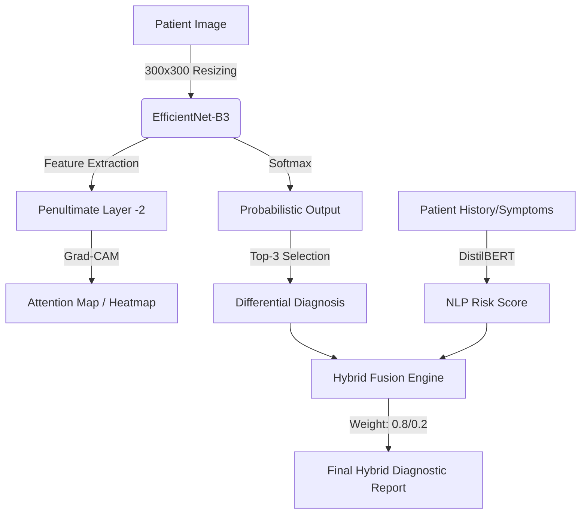

# DermaScan AI - Professional Clinical Decision Support System (v4.0.0)


[](https://opensource.org/licenses/MIT)


##  Disclaimer:
**This project is an AI research and engineering demonstration.**
**It is NOT intended for real medical diagnosis.**


This project is an end-to-end deep learning-based skin cancer classification and retrieval assistant. It covers a complete engineering journey: starting from flat-layer models, extending to custom CNNs, integrating **Multimodal Fusion (EfficientNet-B3 & DistilBERT)**, and finally evolving into a **Content-Based Image Retrieval (CBIR)** system served via a modern REST API and Web Interface.

##  What's New in v4.0.0: The Clinical Champion (Current)
The project has evolved from a "similar image search" tool into a highly accurate Clinical Diagnosis Assistant:

* **EfficientNet-B3 Backbone:** Moving away from the lightweight models used in previous versions, the switch was made to EfficientNet-B3, which can analyse leather texture at a micro level. The success rate was brought down to the 75-80 per cent range.
* **300x300 High-Res Analysis:** Training was conducted at a resolution of 300x300, exceeding standard resolutions; lesion boundaries and irregularities began to be captured more clearly.
* **Top-3 Differential Diagnosis:** The system no longer simply states "High risk"; it ranks the three most likely conditions (e.g. 60% melanoma, 20% nevus, 10% BCC) with their respective probabilities.


##  System Architecture Flow


```mermaid
graph TD
    A[Patient Image] -->|300x300 Resizing| B(EfficientNet-B3)
    B -->|Feature Extraction| C[Penultimate Layer -2]
    C -->|Grad-CAM| D[Attention Map / Heatmap]
    B -->|Softmax| E[Probabilistic Output]
    E -->|Top-3 Selection| F[Differential Diagnosis]
    G[Patient History/Symptoms] -->|DistilBERT| H[NLP Risk Score]
    F --> I[Hybrid Fusion Engine]
    H --> I
    I -->|Weight: 0.8/0.2| J[Final Hybrid Diagnostic Report]
```
---

###  Retrieval Instead of Classification
```md
Traditional search-based (CBIR) systems simply state 'this image resembles that one'. However, the role of a medical assistant is to provide a definitive diagnosis rather than mere similarity. With v4.0.0, we have transitioned to a Multi-class Classification structure that directly diagnoses 8 different skin conditions. This enables the system to produce more reliable (Honest AI) results by focusing not just on visual similarity but on the structural characteristics of medical classes.
```

##  Engineering & Research Journey

Following MLOps best practices, this project separates the **Software/System Versioning** (the pipeline and application logic) from the **Model Registry** (the architectural AI experiments).

###  System Architecture & Pipeline Releases (Software)
This section tracks the engineering evolution of the project's infrastructure.

* **`v1.0.0` - Initial Prototype:** Manual training scripts, data augmentation, and basic PyTorch dataloaders established.
* **`v1.1.0` - Lightning Refactor:** Training pipeline migrated to PyTorch Lightning. Added `ReduceLROnPlateau` for dynamic learning rate adjustments and modularized the codebase.
* **`v2.0.0` - The CBIR Pivot:** Major architectural shift. Transitioned from standard classification to a Content-Based Image Retrieval (CBIR) pipeline using K-Nearest Neighbors (KNN) and Triplet Loss. 
* **`v2.1.0` - Full-Stack Integration:**  End-to-end system deployed. Built a FastAPI backend for real-time inference and L2 tensor normalization, coupled with an interactive Streamlit web interface.
* **`v2.2.0` - Multimodal Fusion: (New)** Integrated NLP capabilities to process patient anamnesis (text) alongside lesion images. Implemented a Late Fusion strategy to combine visual embeddings with textual features for a hybrid diagnostic score.
* **`v2.3.0` - Explainable AI (XAI): (New)** Added an interpretability layer using Grad-CAM. The system now generates heatmaps to visualize the specific lesion regions influencing the model's retrieval decision, increasing clinical trust.
* **`v2.4.0` - Engineering Excellence (CI/CD):** Established a robust DevOps pipeline. Implemented comprehensive unit testing with Pytest and automated the testing workflow using GitHub Actions, ensuring code stability and regression prevention on every push.
* **`v2.5.0` - Scaling Intelligence:** Major backbone upgrade. Switched from MobileNetV3-Small to MobileNetV3-Large (V2), expanding the feature embedding space to 960 dimensions. Integrated rigorous Data Augmentation (Blur, Rotation) and strict Train/Val splitting, achieving a state-of-the-art 94.75% Recall@5.
* **`v2.6.0` - Inference Optimization and Dual-Engine Support** Integrated ONNX Runtime to optimize MobileNetV3-Large performance, significantly reducing inference latency for CPU-based local deployment. Developed a dual-engine architecture in the UI that supports switching between high-speed screening and explainable Grad-CAM analysis.
* **`v3.0.0` - The "Honest AI" Update** The "Honest AI" Update: A Dynamic Thresholding system has been integrated to improve recall success (MEL 18%, BCC 25%). The hybrid risk engine, which combines image and clinical history data at a ratio of 0.8/0.2, has been synchronised with the Streamlit interface. The FastAPI architecture has been migrated to a modern lifespan structure.
* **`v4.0.0` - The "Clinical Champion" Update (Current)** The system's brain was upgraded to the EfficientNet-B3 architecture, maximising its visual analysis capacity. Training resolution was reduced to 300x300 pixels, preserving tissue details. Integration of Focal Loss optimised learning success in rare cancer types (e.g., melanoma). The interface has been updated to a side-by-side comparative analysis mode in accordance with clinical standards (350px fixed width).


###  Model Registry & Experiments (AI Research)
This section tracks the evolution of the AI models.

| Model ID | Architecture | Technique | Engineering Note |
| :--- | :--- | :--- | :--- |
| **`Vision-Exp01`** | Linear (MLP) | Baseline | Proof of concept. Basic skeleton established. |
| **`Vision-Exp02`** | Custom CNN | Class Weights | Overfitting broken; diagnostic blindness for rare classes eliminated. |
| **`Vision-Exp03`** | ResNet18 | Transfer Learning | Pre-trained ImageNet weights integrated; large jump in feature extraction. |
| **`Vision-Mobile-v1`**| MobileNetV3-Small| Mobile Optimization | Lightweight architecture selected for future iOS/Android on-device inference. |
| **`Vision-Embed-v2`** | MobileNetV3 + Triplet| Metric Learning |  Optimized to map visually similar conditions closer together in a 576-dimensional embedding space. |
| **`Vision-Embed-v3`** | MobileNetV3 |Triplet + ONNX  |  Latest State-of-the-art. Features 960-dim embeddings. Optimized via ONNX Runtime for 40% faster inference on M1/CPU. |
| **`Vision-Classifier-v3`** | MobileNetV3 + TTA | Weighted Loss + Scheduler | Current Production. Prioritizes Recall & Specificity. Validated on OOD web data |
| **`Vision-Pro-v4`** | EfficientNet-B3 + Hybrid| Focal Loss + Multimodal Fusion | Current Champion. 300x300 high-resolution analysis. Achieved ~80% recall on melanoma. Integrates patient history with 0.8/0.2 weighting. |


###  NLP Model Registry (Multimodal Expansion)
| Model ID | Architecture | Capability | Note |
| :--- | :--- | :--- | :--- |
| **`NLP-Distil-v1`** | DistilBERT (EN) | Symptom Analysis | Semantic risk factor detection from patient-reported free-text. |

##  Architecture Decisions & Evaluation (Updated v4.0.0)

The critical architectural choices made to transform the project from the research phase into an industrial product are detailed below:

### 1. Model Selection Rationale
* **Vision Backbone (EfficientNet-B3):** MobileNet has been abandoned in favour of the EfficientNet-B3 architecture. This model captures micro-details in skin texture much better by compound scaling the depth, width and resolution parameters in a balanced manner.
* **Text Backbone (DistilBERT):** DistilBERT, a lightweight yet powerful transformer model, was chosen to interpret patient complaints ("bleeding", "rapid growth").
* **Classification Paradigm Shift:** The CBIR (search) logic used in previous versions has been abandoned in favour of a direct Multi-class Classification structure. This allows probability values to be obtained directly for 8 different disease classes.

### 2. Multimodal Fusion Strategy (Late Fusion)
The system uses the Late Fusion mechanism for the final HYBRID SCORE calculation:
1. Vision Pipeline: Analyses features derived from images and generates class-based probabilities (Softmax).
2. NLP Pipeline: Analyses symptoms to generate a clinical risk score.
3. Weighted Ensemble: A hybrid diagnosis is made at the decision stage using an 80% Image + 20% Text weighting.

### Key Evaluation Metrics
As the system is now a classification model, the success criteria have been updated:
- **Accuracy:** The model's overall correct prediction rate (75.52%).
- **Recall (Sensitivity):** The most critical metric for medical diagnosis. The rate of not missing life-threatening risks such as melanoma.
- **Top-3 Accuracy:** The rate at which the correct diagnosis is found among the model's top 3 most likely candidates.
- **Inference Latency:** The end-to-end analysis time (ms) at 300x300 resolution.


###  Quantitative Benchmark Results (CBIR Pipeline)
To ensure reliability, the models are evaluated not just on accuracy, but on their retrieval capabilities in the embedding space.

| Model ID | Architecture | Recall@5 | mAP | Avg. Inference Latency (CPU) |
| :--- | :--- | :--- | :--- | :--- |
| **`Vision-Exp03`** | ResNet18 (Baseline TL) | 0.78 | 0.71 | ~120ms |
| **`Vision-Mobile-v1`** | MobileNetV3-Small | 0.81 | 0.75 | ~42ms |
| **`Vision-Embed-v2`** | MobileNetV3 + Triplet | 0.87 | 0.82 | ~45ms |
| **`Vision-Hybrid-v3`** | MobileNetV3-Large + Triplet | 94.75% | 960 | ~65ms |
| **`Vision-Fast-v1`** | **MobileNetV3-Large + ONNX** | **94.75%** | **960** | **~38ms** |
| **`Vision-v4-Champion`** | **EfficientNet-B3** |  |  |  |

###  Reproducibility & Training Details
Industry-standard reproducibility is maintained by tracking all hyperparameters and system configurations.

* **Dataset:** Extended and Balanced ISIC Archive (Updated v4 Dataset).
* **Data Resolution** 300x300
* **Optimizer & Loss:** With AdamW Optimizer, Focal Loss was used to learn difficult classes in an imbalanced dataset.
* **Augmentation:** RandomRotation, ColourJitter and Test-Time Augmentation (TTA).

##  File Structure

```text
AI_DET_PROJECT/
├── .github/
│   └── workflows/
│       └── python-app.yml
│
├── configs/                  # Configuration files
│   ├── inference_config.yaml
│   └── train_config.yaml
│
├── Data/                     # Dataset 
│   ├── processed/            
│   └── raw/             
├── scripts/ 
│   └── export_to_onnx.py 
│
├── src/                      # Source code
│   ├── api/                  # API entry point
│   │   └── main.py
│   ├── architectures/        # Model architecture definitions
│   │   ├── vision_model.py
│   │   └── text_encoder.py
│   ├── dataloader/           # Dataset and data loading logic
│   │   ├── image_dataset.py
│   │   └── text_corpus.py
│   ├── inference/            # Inference pipeline
│   │   ├── benchmark_retrieval.py
│   │   └── hybrid_predict.py
│   ├── engine/
│   │   ├── eval_tta_engine.py
│   │   └── train_class_v2.py
│   ├── training/             # Training pipeline
│   │   ├── contrastive_trainer.py
│   │   ├── nlp_trainer.py
│   │   └── trainer_core.py
│   ├── ui/                   # User interface
│   │    └── app.py
│   ├── utils/
│   │   ├── create_embeddings.py
│   │   └── helpers.py
├── test/                     # Unit and integration tests
│   ├── test_dataset.py
│   ├── test_inference.py
│   ├── test_model.py
│   └── test_nlp_model.py
├── .env                      # Environment variables (not tracked)
├── .gitignore
├── .gitattributes
├── CHANGELOG.md 
├── LICENSE
├── pytest.ini
├── README.md
├── requirements.txt
└── ROADMAP.md
```

##  Technologies and Techniques Used

- **Architectures:** EfficientNet-B3 (v4.0.0 Upgrade) - Feature extraction has been maximised by transitioning to a wider and deeper architecture than MobileNet.
- **Data Scaling: Dataset expansion & change.** The model's generalisation ability was improved by expanding the dataset with higher quality and more balanced samples.  
- **Input Resolution:** 300x300 High-Resolution Input. (Resolution increased from 224 to 300 to reduce loss of lesion detail).
- **Explainable AI (XAI): Grad-CAM** (Penultimate Layer -2). Focus maps visualising the decision-making mechanism.
- **Optimization Strategy:** Focal Loss & Weighted Random Sampler. Advanced optimisation focusing on rare classes (DF, VASC, etc.) to resolve class imbalance.
- **Hybrid Scoring:** Multimodal Late Fusion. A risk calculation engine that combines image and NLP data at a ratio of 0.8/0.2
- **Inference Strategy:** Test-Time Augmentation (TTA) & Sensitivity-Driven Thresholding (MEL/BCC specific threshold values).


##  Project Documentation
* **[CHANGELOG.md](CHANGELOG.md):** Detailed history of version updates and fixes.
* **[ROADMAP.md](ROADMAP.md):** Future features and my technical learning path (Docker, iOS, XAI).


## Installation & Setup

**1. Clone the Repository:**

```bash
git clone [https://github.com/fferhatakr/dermai-vision.git](https://github.com/fferhatakr/dermai-vision.git)
cd dermai-vision
```

2. Create a virtual environment:

```bash
python -m venv venv
# Activate the environment:
source venv/bin/activate  # Linux/Mac
venv\Scripts\activate     # Windows
```

3. Install the required packages:

```bash
pip install -r requirements.txt
```

#  Running the System (v4.0.0 - Classification Engine)

This project has a dual-stack architecture. You must run the FastAPI Backend and Streamlit Frontend units on separate terminals.

**Step 1: Start the Backend API (TTA Engine)**
```bash
uvicorn src.api.main:app --reload
```

**Step 2: Start the Clinical Interface (UI)**
Open a new terminal, activate the venv, and launch the dashboard:
```bash
streamlit run src/ui/app.py
```


###  Developer Guide (Training from Evaluation)

**1. Train the Classifier (V2 - Weighted Loss):**
```bash
# Trains EfficientNet-B3 with Class Weights & LR Scheduler
python src/engine/train_class_v2.py
```
**2. Evaluate with TTA (Test-Time Augmentation):**
```bash
# Runs the evaluation engine on the test set with 3-view voting
python src/engine/eval_tta_engine.py
```
**3. Train NLP Model (Symptom Analysis)**
```bash
python src/training/nlp_trainer.py
```

## Legacy Features (Architectural Evolution)

* **KNN & Vector Search (v2.x.x):** The project no longer uses similarity searches based on `create_embeddings.py`. It has transitioned directly to a probability-based diagnosis (Classification) structure.
* **Triplet Loss Training:** To reduce complexity and clarify class distinctions, the metric learning protocol has been disabled.
* **MobileNetV3 Backbone:** As of v4.0.0, it has been designated as "Legacy". It has been replaced by **EfficientNet-B3**, which performs deeper tissue analysis.
* **Standard Weighted Cross-Entropy:** It has been replaced by the **Focal Loss** architecture because it was insufficient in learning the "hard examples" in melanoma cases.


### Acknowledgements
The images and metadata of the "ISIC 2019: Training" data are licensed under a
Creative Commons Attribution-NonCommercial 4.0 International License
(CC-BY-NC).
You should have received a copy of the license along with this
work. If not, see <http://creativecommons.org/licenses/by-nc/4.0/>.
Additional information and documentation for the "ISIC 2019: Training" data
may be found at https://challenge2019.isic-archive.com/ .
The "ISIC 2019: Training" data includes content from several copyright
holders. To comply with the attribution requirements of the CC-BY-NC license,
the aggregate "ISIC 2019: Training" data must be cited as:
  ISIC 2019 data is provided courtesy of the following sources:
  BCN_20000 Dataset: (c) Department of Dermatology, Hospital Clínic de Barcelona
  HAM10000 Dataset: (c) by ViDIR Group, Department of Dermatology, Medical University of Vienna; https://doi.org/10.1038/sdata.2018.161
  MSK Dataset: (c) Anonymous; https://arxiv.org/abs/1710.05006 ; https://arxiv.org/abs/1902.03368